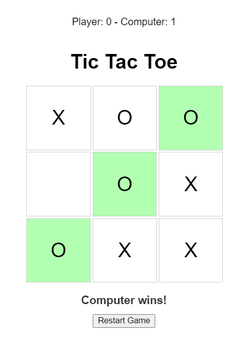

All the code and information in this repository, including the README file, was generated through a series of exchanges with GPT-4.

# Tic Tac Toe

A simple Tic Tac Toe game built with HTML, CSS, and JavaScript. The game allows you to play against the computer, which uses a combination of the Minimax algorithm and random moves for making its moves. 

Try it here: https://gamedevalice.github.io/tic-tac-toe/

## Features

- Play against the computer
- Computer AI based on the Minimax algorithm and random moves
- Displays messages for wins and draws
- Option to restart the game
- Keeps track of scores

## Getting Started

To run the game locally, follow these steps:

1. Clone the repository:

`git clone https://github.com/gamedevalice/tic-tac-toe.git`

2. Open the `index.html` file in your web browser.

## File Structure

- `index.html`: Main HTML file containing the structure of the game.
- `styles.css`: Contains the styling for the game.
- `script.js`: Contains the JavaScript code for handling the game logic, computer AI, and interactivity.

## License

This project is licensed under the [MIT License](LICENSE).
